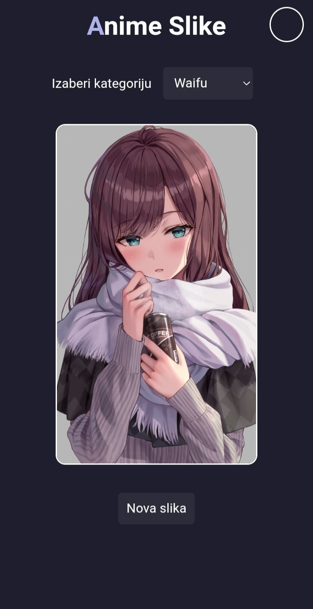

# Anime Randomer

**Anime Randomer** je ambiciozan projekat fokusiran na ljubitelje anime kulture. Aplikacija omogućava korisnicima istraživanje nasumičnih anime slika i informacija putem eksternih API-ja, uz personalizovano korisničko iskustvo.

Projekt je razvio nezavisni programer pod pseudonimom **Akane396**. Razvoj je započeo sa 15 godina kao rezultat strasti prema programiranju, a kroz proces izrade fokus je bio na savladavanju front-end tehnologija, radu sa API servisima i rešavanju kompleksnih logičkih problema.

---

## 🔗 Link ka projektu
Možete pristupiti aplikaciji uživo ovde:
👉 [**Anime Randomer - Live Demo**](https://akane396.github.io/Random_Anime-slike/anime.html)

---

## 🚀 O Projektu

Glavni cilj sajta je da pruži brz i zabavan način za otkrivanje novog anime sadržaja. Sistem koristi API za dinamičko povlačenje podataka, osiguravajući da je sadržaj uvek svež i raznolik.

### Glavne karakteristike:
* **Dinamički API:** Automatsko povlačenje slika i podataka sa eksternih izvora.
* **Sistem Autentifikacije:** Registracija, prijava i odjava korisnika (Supabase integracija).
* **Korisnički Profili:** Svaki korisnik ima svoj nalog.
* **Premium Sekcija:** Ekskluzivni sadržaj dostupan unutar posebnog dela sajta.
* **Žanrovi:** Filtriranje sadržaja prema kategorijama.

---

## 🛠 Tehnologije

Projekat je izgrađen korišćenjem modernih web tehnologija sa fokusom na optimizaciju i čistu strukturu koda:

* **HTML5 & CSS3:** Za strukturu i moderan, minimalistički dizajn.
* **JavaScript (ES6+):** Za logiku aplikacije i interakciju sa korisnikom.
* **Rest API:** Integracija eksternih podataka u realnom vremenu.
* **Responsive Design:** Osnova za prilagođavanje različitim uređajima.

---

## 📈 Planirani Razvoj (Roadmap)

Projekat se aktivno razvija, a u planu su sledeće funkcionalnosti:

- [x] Integracija API-ja za slike
- [x] Sistem registracije i prijave korisnika
- [x] Funkcionalnost odjave (Logout)
- [x] "O nama" sekcija i Premium modul
- [ ] **Globalni Chat:** Komunikacija sa drugim korisnicima u realnom vremenu.
- [ ] **Privatne Poruke:** Razmena poruka i datoteka između korisnika.
- [ ] **Potpuna Responsivnost:** Optimizacija korisničkog interfejsa za sve mobilne uređaje.
- [ ] **Napredne Animacije:** Poboljšanje korisničkog iskustva kroz vizuelne efekte.
- [ ] **AI Asistent:** Implementacija 3D Anime asistenta baziranog na veštačkoj inteligenciji.
- [ ] **Prilagođavanje izgleda:** Dark/Light mod i podrška za pozadinske slike po izboru.

---

## 📸 Pregled interfejsa

---

## 📄 Licenca i korišćenje

Kôd je otvorenog tipa i dostupan za edukativne svrhe. Možete ga preuzeti, analizirati i pokrenuti u svom omiljenom editoru koda. 

**Autor:** [Akane396]